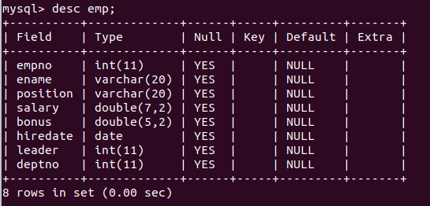

***注：这几篇文章中会用到的表***

1. 部门表(dept)


```sql
# dept表
create table dept(
	id int primary key auto_increment,
    deptno int unique not null,
    dname varchar(10) not null,
    location varchar(20)
);
# 插入数据
insert into dept 
(deptno,dname,location)
values
(10,"研发部","南京"),
(20,"市场部","浙江"),
(30,"行政部","杭州"),
(40,"财务部","扬州");
```

2. 员工表(emp)



3. 学生信息表


```sql
# 学生表studentinfo
create table studentinfo(
    stuno int primary key auto_increment,
    stuname varchar(15) not null,
    stubirth date,
    stusex int(4),
    stuaddr varchar(20),
    stutel varchar(11)
)

# 插入数据
insert into studentinfo
(stuname,stubirth,stusex,stuaddr,stutel)
values
("张三","1998-02-01","男","南京","151123232"),
("李四","1993-04-02","男","杭州","151663232"),
("王五","1994-06-08","女","北京","131123232"),
("赵六","2000-02-01","男","湖南","151197972"),
("钱七","2003-10-01","女","南京","131123232"),
("孙八","1988-12-01","女","杭州","151143222");
```

4. 成绩表(scoreinfo)


```sql
# 成绩表scoreinfo
create table scoreinfo(
	id int primary key auto_increment,
    stuno int not null,
    classno int not null,
    score int
);
```

5. 科目表(classinfo)


```sql
# 班级表classinfo
create table classinfo(
	classno int primary key auto_increment,
    classname varchar(10) not null
);

# 插入数据
insert into classinfo
(classno,classname)
values
(1,"数学"),
(2,"语文"),
(3,"英语"),
(4,"物理");
```

